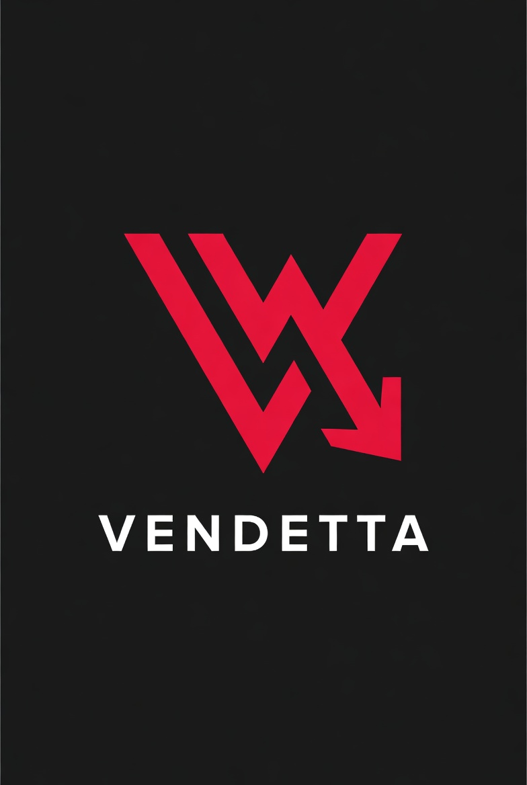

<div align="center">
  

# VENDETTA

**The Community Price Transparency Network**

*Scan prices. Anchor truth on blockchain. Earn IFR rewards.*

[](LICENSE)
[](#testing)
[](#testing)
[](#security)
[](https://sepolia.basescan.org)
[](https://api.studio.thegraph.com/query/1744627/vendetta-price-network/v0.1.0)
[](https://ifrunit.tech)

[Landing Page](https://neabouli.github.io/vendeta/) · [Wiki](docs/wiki/Home.md) · [Architecture](docs/architecture/decisions.md) · [IFR Token](https://ifrunit.tech)

</div>

---

## What is Vendetta?

Vendetta is an open-source, community-driven platform where consumers record and share prices for everyday products and services.

Every price entry is **cryptographically proven** and anchored on blockchain — immutable, verifiable, rewarded.

```
User scans EAN barcode
→ SHA-256 hash + GPS + timestamp
→ Anchored on Base L2
→ Searchable by radius (<50ms)
→ Rewarded with IFR tokens
```

## Live Deployments

### Base Sepolia Testnet

| Contract | Address | Basescan |
|---|---|---|
| VendRegistry | `0x77e99917Eca8539c62F509ED1193ac36580A6e7B` | [↗](https://sepolia.basescan.org/address/0x77e99917Eca8539c62F509ED1193ac36580A6e7B) |
| VendTrust | `0x769928aBDfc949D0718d8766a1C2d7dBb63954Eb` | [↗](https://sepolia.basescan.org/address/0x769928aBDfc949D0718d8766a1C2d7dBb63954Eb) |
| VendRewards | `0x670D293e3D65f96171c10DdC8d88B96b0570F812` | [↗](https://sepolia.basescan.org/address/0x670D293e3D65f96171c10DdC8d88B96b0570F812) |
| VendClaim | `0x4807B77B2E25cD055DA42B09BA4d0aF9e580C60a` | [↗](https://sepolia.basescan.org/address/0x4807B77B2E25cD055DA42B09BA4d0aF9e580C60a) |

### The Graph Subgraph

`https://api.studio.thegraph.com/query/1744627/vendetta-price-network/v0.1.0`

## Architecture

```
Flutter App (Android + iOS)
│
├── vendeta-core (Rust FFI)
│   hash · ean · location · geohash
│   currency · wallet (BIP39/BIP44)
│
├── flutter_map + OpenStreetMap
│
├── The Graph (GraphQL — read)
│   8 entities · 11 event handlers
│
└── Base L2 Smart Contracts (write)
    VendRegistry → VendTrust
    → VendRewards → VendClaim
    │
    IFR PartnerVault
    (ETH Mainnet)
```

**Serverless-first.** The Graph replaces PostgreSQL. Blockchain is the single source of truth.

## Smart Contracts

| Contract | Purpose | Tests |
|---|---|---|
| VendRegistry.sol | Submissions, duplicates, first-mover | 12 ✅ |
| VendTrust.sol | Trust 0-1000, weighted votes, locality lock | 14 ✅ |
| VendRewards.sol | Credits, tier multipliers, IFR premium | 17 ✅ |
| VendClaim.sol | Credits → IFR bridge, 7d cooldown | 17 ✅ |

**Security:** Slither audit — 0 High/Medium findings

## IFR Tier System

| Tier | Lock | Rewards |
|---|---|---|
| FREE | 0 IFR | 0.5× |
| Bronze | 1,000 IFR | 1.0× |
| Silver | 5,000 IFR | 1.25× |
| Gold | 10,000 IFR | 1.5× |
| Platinum | 50,000 IFR | 2.0× |

Lock IFR → more rewards + trust boost. Unlock anytime — no slashing, no vesting.

## Tech Stack

| Layer | Technology |
|---|---|
| Mobile | Flutter (Android + iOS) |
| Core | Rust + flutter_rust_bridge |
| Blockchain | Base L2 (Coinbase) |
| Token | IFR (ifrunit.tech) |
| Search | The Graph Protocol |
| Maps | flutter_map + OpenStreetMap |
| Identity | Nullifier Pattern (GDPR) |
| Wallet | BIP39/BIP44 HD Wallet |

## Getting Started

```bash
git clone https://github.com/NeaBouli/vendeta
cd vendeta

# Rust Core (36 tests)
cd core && cargo test

# Smart Contracts (60 tests)
cd contracts && forge install && forge test

# Flutter App
cd mobile && flutter pub get && flutter analyze
```

## Testing

```
Rust Core:   36 tests passing
Solidity:    60 tests passing
Flutter:     0 issues (flutter analyze)
Security:    Slither — 0 High/Medium
```

## Roadmap

- [x] Phase 0 — Architecture & Planning
- [x] Phase 1 — Smart Contracts (Base L2)
- [ ] Phase 2 — Mobile App (Android + iOS)
- [ ] Phase 3 — Testnet Beta + Audit
- [ ] Phase 4 — Mainnet Launch (Europe)
- [ ] Phase 5 — DAO Governance & Global

## Privacy

**Zero personal data stored.**

Nullifier Pattern: phone number used once for OTP, immediately discarded. Only a SHA-256 hash ever touches the chain. GDPR compliant by design.

## IFR Token

Vendetta is an official **IFR Builder** (Issue [#12](https://github.com/NeaBouli/inferno/issues/12)).

- Token: [$IFR](https://ifrunit.tech)
- Ecosystem: [ifrunit.tech](https://ifrunit.tech)
- PartnerVault: 40M IFR reserved

## Contributing

MIT License — contributions welcome. See [docs/wiki/Contributing.md](docs/wiki/Contributing.md)

---

<div align="center">
Built in Greece. For Europe. Open Source.<br>
<sub>© 2026 Vendetta — MIT License</sub>
</div>
